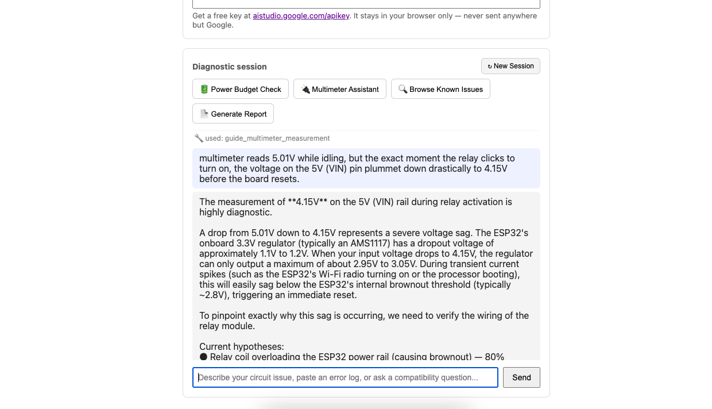
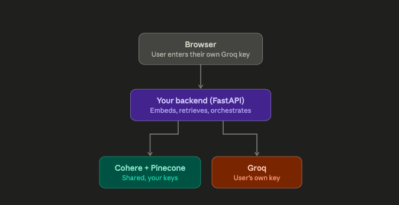
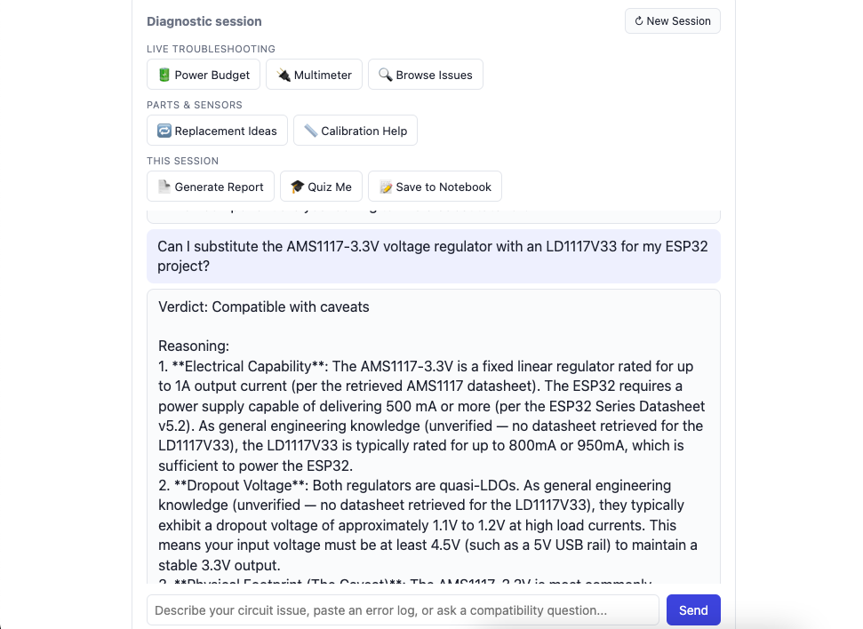

# AI Lab Mentor — Circuit Diagnostic AI

An ESP32 electronics troubleshooting assistant that behaves like a lab mentor, not a search engine: it asks one question at a time, tracks its own hypotheses, insists on a real measurement before it'll speculate, and refuses to state a number it can't source. Live at **[ai-lab-mentor.onrender.com](https://ai-lab-mentor.onrender.com)** — bring your own free Groq or Gemini API key, nothing is stored server-side.



---

## Scope & Intent

This project has two goals that had to both be true at once, not one traded off against the other: a tool that genuinely helps someone debug a blank OLED or a brownout reset, and a demonstration of what real AI engineering looks like beyond prompting a chatbot. The second goal shaped almost every decision below — this repo is built to be read, not just run.

Concretely, that meant treating a handful of things as non-negotiable from the start:

- **A hard $0 budget**, for the author and every user — no paid tiers, no shared API keys draining under load. This constraint, more than any other, is what forced the architecture into its current shape (see the BYOK section below).
- **Every claim the assistant makes has to be traceable** to a real datasheet chunk, a hardcoded board-safety fact, a tool's computed output, or an explicit "unverified — general knowledge" flag. Never a plausible-sounding invented number.
- **Every phase of the build is documented with what broke, not just what shipped.** The [`build-logs/`](./build-logs) folder is the actual engineering record — platform bugs routed around, prompt fixes that failed twice before working, a real hallucination bug caught and fixed via live testing. That record is as much the point of this repo as the running app is.
- **Feature scope is a deliberate, documented decision, not a running total.** Four additional tools (Symptom → Root Cause Mapping, Component Replacement Suggestion, Sensor Calibration Assistant, AI Lab Notebook) were designed and built in an exploratory phase, then cut before final release to keep the tool-selection surface small and every remaining tool reliably grounded — see [Phase 8](./build-logs/PHASE8_LOG.md) and "Descoped Features" below.

---

## Architecture & Tech Stack

```
Browser (provider dropdown: Groq or Gemini, user's own API key — BYOK)
        │
        ▼
FastAPI backend (main.py)
        │
        ├── retrieve_context()  ──────────────►  Cohere embeddings + Pinecone
        │                                        (shared keys — cheap, read-mostly,
        │                                         datasheets + curated failure library)
        │
        └── agent.run_agent_turn()
                │
                ├── providers/  ──► one abstracted interface, per-provider adapters
                │     groq_provider.py    (OpenAI-compatible wire format)
                │     gemini_provider.py  (native translation layer, incl. Gemini 3.x
                │                          "thought_signature" handling on tool calls)
                │
                ├── tools/dispatcher.py  ──► 5 real, callable tools
                │     check_component_compatibility   (board profile + RAG)
                │     analyze_error_log                (structured signature matching + RAG)
                │     generate_diagnostic_report        (10-section synthesis)
                │     calculate_power_budget             (pure Ohm's-Law/current-sum math)
                │     guide_multimeter_measurement       (board profile + RAG, "measure before speculate")
                │
                ├── AI Lab Viva Mode  ──► prompt-only persona (no tool schema, no
                │                         retrieval call) — quizzes the user Socratically
                │                         on their own diagnostic reasoning instead of
                │                         the model doing the asking
                │
                └── grounding_guard.py  ──► deterministic post-generation check: strips
                      any document version/section/page locator ("Datasheet v5.2",
                      "Section 8") the model invented but never actually retrieved this
                      turn. Added after the equivalent prompt-only rule failed live
                      testing twice on this exact pattern — a code-level backstop
                      instead of a third prompt patch.
```

<details>
<summary>Earlier architecture (Phase 6.0, single-provider) — kept for the record, superseded by the diagram above</summary>



This was the shape of the backend right after the Flowise migration, before Phase 6 added Gemini as a second BYOK provider and replaced hardcoded mode-detection with real tool-calling. Kept here rather than deleted — the diff between this and the current diagram is itself part of the engineering record.
</details>

| Layer | Choice | Why |
|---|---|---|
| Backend | FastAPI (Python) | Self-hosted, replacing a platform (Flowise) that couldn't isolate per-user quota |
| LLM providers (BYOK) | Groq (`llama-3.3-70b-versatile`), Google Gemini (`gemini-3.5-flash`) | User supplies their own free key; generation is the expensive part and the one that must never be shared |
| Provider abstraction | `providers/base.py` — `ChatResult`/`ToolCall` dataclasses | Adding a third provider means writing one adapter, not touching `agent.py` |
| Retrieval | Cohere `embed-english-v3.0` + Pinecone (serverless) | Shared keys — read-mostly embedding/query traffic has far more free-tier headroom than generation |
| Ground truth | `ground_truth.py` — ESP32 GPIO board profile, error-signature table | Small, fixed, safety-relevant facts belong in tested Python data, not re-derived from a prompt every turn |
| Tool-calling agent | `agent.py`, capped at 5 iterations | The model selects tools based on conversation context — no hardcoded routing |
| Grounding backstop | `grounding_guard.py` | A deterministic check for one narrow, repeat-offending fabrication pattern that two rounds of prompt engineering didn't fully close |
| Frontend | Static HTML/CSS/vanilla JS | Deliberately no framework — the interesting engineering here is server-side |
| Hosting | Render (free tier) | $0 budget constraint; documented tradeoff: ~30-50s cold-start after idle |

---

## Iterative Engineering & Validation Phases

Every phase below shipped only after the previous one's core claim was actually tested — not just implemented. The full narrative, including failed attempts and root-cause analysis, lives in each linked log.

| Phase | What it added | What it proved or broke |
|---|---|---|
| [1](./build-logs/PHASE1_LOG.md) | Core diagnostic engine — no RAG, no structured memory | Found two real bugs (redundant re-asking, evidence reversal at conclusion) and root-caused both to unstructured buffer memory, not prompt wording |
| [2](./build-logs/PHASE2_LOG.md) | Structured Project Memory (explicit JSON state, not inferred from chat text) | Fixed both Phase 1 bugs; also proved the negative result that mattered most — structured memory alone gets the model to the right *category* of fault, never the specific documented cause, without real grounding |
| [3](./build-logs/PHASE3_LOG.md) | Datasheet-aware RAG (Cohere + Pinecone) | Two embedding providers failed for platform-side reasons before finding a stable pairing; verified retrieval was semantically real (not keyword luck) against an exact, obscure datasheet figure |
| [4](./build-logs/PHASE4_LOG.md) | Compatibility Checker, Error Log Analyzer, Report Generator | Caught a genuine safety-relevant bug — a source/sink current-limit mix-up that produced a false "Compatible" verdict on an unsafe GPIO connection — before it ever reached the flagship test case |
| [5](./build-logs/PHASE5_LOG.md) | Mandatory engineering-mechanism explanations, live confidence display, learning resources | Proxy-tested every feature with a stand-in model before spending real quota on the target model — caught two real bugs for free |
| [6.0](./build-logs/PHASE6_0_LOG.md) | Migration off Flowise to a self-hosted FastAPI backend, per-user BYOK | Solved the actual structural problem motivating the rebuild: one shared Flowise/Groq key meant any friend testing the app silently drained the author's quota |
| [6](./build-logs/PHASE6_LOG.md) | Multi-provider BYOK (Groq + Gemini) + genuine tool-calling agent | The real "workflow → agent" milestone — replaced a hardcoded single-prompt routing instruction with real function-calling; confirmed live, on both providers, that the model autonomously invokes ≥2 different tools in one conversation with no routing rule telling it which to use |
| [7](./build-logs/PHASE7_LOG.md) | Power Budget Calculator, Multimeter Assistant, Symptom → Root Cause Mapping | Found and fixed a real hallucination bug via live testing (a tool fabricating a user's measurement instead of waiting for one); fully diagnosed a Groq rate-limit ceiling down to its exact mechanism rather than patching blind |
| [8](./build-logs/PHASE8_LOG.md) | Final scope cut (9 capabilities → 5 tools + Viva Mode), `grounding_guard.py` code-level fabrication backstop, dead-code and repo cleanup, license | A live-caught fabricated citation (a nonexistent "ESP32 Series Datasheet v5.2") closed a prompt-only rule's third failure with a deterministic check instead of a fourth patch; four working, tested tools were deliberately removed to keep the shipped surface reliably grounded |

**The throughline:** Phases 1-2 built the reasoning loop and proved it needed grounding. Phase 3 supplied that grounding. Phases 4-5 turned it into real, tested capabilities. Phase 6.0 solved the problem that made the project unshippable to more than one person at a time. Phase 6 turned a single clever prompt into an actual multi-tool agent. Phase 7 proved that architecture scales to new capabilities without being rebuilt, and caught a real bug the moment a new tool shape stressed an assumption the earlier tools never tested. Phase 8 proved the harder discipline — cutting working code and closing a recurring bug with an engineering control instead of a fourth prompt patch, rather than shipping everything that was ever built.

---

## Descoped Features

Four tools were designed, built, and unit-tested in an exploratory phase, then deliberately removed before final release:

- **Symptom → Root Cause Mapping** — a browsable failure-category index
- **Component Replacement Suggestion** — cross-referencing substitute parts against the loaded datasheet corpus
- **Sensor Calibration Assistant** — factory-calibrated vs. empirical calibration guidance
- **AI Lab Notebook** — short, dated session-log entries distinct from the full Report Generator

None were cut for being broken — all had passing structural tests. They were cut because Groq's free-tier TPM ceiling (documented in detail in Phase 7's log) made a large tool-schema list a real, measured cost on every turn, and because two of them (Component Replacement, Sensor Calibration) relied on a hand-curated index explicitly flagged in its own docstring as unverified against real datasheets — a thinner grounding guarantee than the rest of this project holds itself to. Keeping the final toolset small and reliably grounded won out over feature breadth. The code is preserved in git history rather than left running unwired in the final app.

At its widest point the frontend had grown to eight quick-action buttons across three groups — and, in the same session captured below, produced the exact kind of fabricated citation `grounding_guard.py` was subsequently built to catch (a confidently-stated "ESP32 Series Datasheet v5.2" that was never actually retrieved):



Full writeup of both the scope decision and the bug in [`PHASE8_LOG.md`](./build-logs/PHASE8_LOG.md).

---

## Results So Far

- **5 real, callable tools**, spanning three genuinely different mechanisms: grounded lookup (board profile + RAG), pure deterministic computation (Ohm's Law, current summation), and structured signature matching — plus a prompt-only Viva Mode persona and a deterministic grounding-guard backstop that catches a fabrication pattern two rounds of prompt engineering didn't fully close.
- **60 passing structural tests**, zero API calls, covering pure logic, dispatcher integration, the grounding guard's locator-stripping behavior, and the exact call shape the agent loop uses — run before a single token of real model quota is spent on any change.
- **Live-confirmed on both providers**: the model autonomously selecting between multiple tools in one conversation (Phase 6's actual definition of done), not just passing a unit test.
- **One real hallucination bug found and fixed through live testing, not assumed away** — a tool was fabricating a user's multimeter reading instead of waiting for a real one; root-caused, fixed with a targeted prompt rule, confirmed fixed on retest.
- **A second, distinct hallucination pattern caught live and closed with code, not a third prompt patch** — a fabricated datasheet version tag, after the equivalent prompt-only rule had already failed twice on the same pattern.
- **One real infrastructure ceiling fully diagnosed, not just patched around** — a Groq rate-limit failure was traced to its exact mechanism (the API reserving the full response-token budget against the rate limit, not just prompt content) via a deliberate before/after arithmetic check, rather than trial-and-error retries.
- **Deployed and publicly reachable**, tested end-to-end against the live instance, not just localhost.

---

## The Core Engineering Value

The easy version of this project is a system prompt wrapped around an API call. What's actually here is meant to demonstrate the difference:

- **Tool-use over prompt-only routing.** Phase 6 exists specifically because a single giant prompt doing internal "mode detection" is not agentic behavior, and the project says so plainly in its own logs rather than calling it something it isn't.
- **Grounding discipline enforced structurally, not just requested.** Ground-truth Python data for safety-critical fixed facts, RAG for genuine long-form knowledge, a deterministic code-level backstop for the one fabrication pattern prompting alone couldn't fully close, and an explicit, tested rule against inventing a number in *either* a stated fact or a piece of fabricated dialogue — the latter being a real bug this project found and fixed, not a hypothetical.
- **Provider-agnostic by design, not by accident.** Adding Gemini after Groq took one adapter, not a rewrite, because the abstraction boundary was decided before the second provider existed.
- **Multi-tenancy taken seriously under a real constraint.** BYOK isn't a security theater checkbox here — it's the direct, load-bearing fix for a real quota-exhaustion bug that made the original version unshareable.
- **Debugging methodology that survives scrutiny.** Every phase log documents what failed and why, including dead ends (two abandoned embedding providers, a confirmed unfixable platform bug routed around structurally, three failed prompt-patch attempts before a working fix). That's the actual evidence of engineering judgment — not the feature list, the decision trail behind it.
- **Knowing when to cut, not just when to add.** Four working, tested tools were removed from the final release because they didn't meet the same grounding bar as the rest of the project, under a real, measured infrastructure constraint — a scope decision documented as deliberately as any feature was.
- **Cost-awareness as an engineering constraint, not an afterthought.** Structural tests before real API calls, proxy-testing with a cheaper model before burning quota on the target model, and — when a real rate-limit ceiling was hit — diagnosing it down to an exact, verified mechanism instead of guessing at fixes.

---

## License

Released under the [MIT License](./LICENSE) — free to use, fork, and adapt, with attribution.
